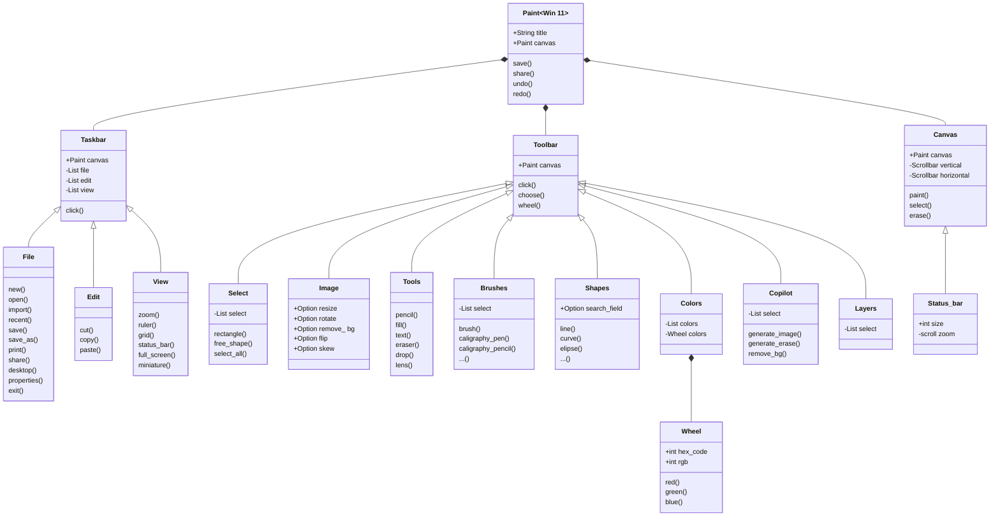

# reto_2
This repository refers to the activities proposed for class 5 of the Object Oriented Pogramming course.
___

- [Link to mermaid.live editor](https://mermaid.live/edit#pako:eNp9VW1v2jAQ_iuRP20roAbKW7RPY600qdImUbXShBQZ50gsHDuyHQp07W-f48ROoLR8ujvs57m753x5QUQkgCJEGFbqJ8WpxPmKWy_4gynXwdsT5UEYvgUvKx6Y39VSS8rTQFPNoAnVJwnmO6zqkMI7-PK1sTMsvVPyRDhbQm2_rrjjfMBqu8bSk71H7t9TpYMNdeS1DwnVXX9H4bn2CaNk27DUaN_6fcfTIRaCfUrscSo7E0K5kp4zAPaeoMZrCRYW6rPClkQKZpPYgdSUYPbuj0xIehRcu7-KCsX3GRgQ74HEdYonaS0aQpfVnemjy4nDs7ssCuDOpnkhpG41I9Ch7Mps7Bgr5xaym1p3BBJQWy2K9qBhM_WCvwp7qpvM3Tx8_2eSv7Oiu9RvjeQudVJ6KiKKg4fGSsMlpFs7Lg7p0QyLQzoKkftaSwbSOamkiS9HY12q2MC5yKZkLFZEQtu3nHJqjsmLCTza-XQJLK1yLoV6gms1fdM15inzLdwYotg0tYBT8WPM3Ci6gbZ0ywbMEf7Kcep1v_pdaCq4YVH0CGcxYUo9j0EujNTBOj2NbxgtTiNqW1V5nowlP315_l2YuSOU-TIp87aG_els-94nsh0mBlxdaoAlaTl_yFJloD7u-Lo64EcKM2oWY5Ed4s67OI12sh4MBpdSaDg7qlf6qXMVFGBJsnhDgSVNTZR7mUkp2xcHpuF-DX1EW7N09pBgQp5VTmysiTxV-8yHzuEWTbyFKygTn8xuCtzIpSGmlez-NbmoX1P1nNvJWqeXCmmYWup7fAD5gYbnl-uznd77F-z7X63I9gH0lV26dh9YuGZ_1z31t1vEum1dsAz2cfV57YRkuvafvnaxdJbGmpVuXzRCVVvbYqMeqnYQirQsoYdykDmuXGQ5V0hnkMMKRcZMsNyukEExdwrM_5oa3DUpyjRD0QYzZbyySIwIzXffHcGlFssDJ_4K8ATkQpRcoygMhxYTRS9oj6L-aDQdzEc3o3A4G46NM5320AFFw-vBcD6fDKfDyfxmOg5vxq89dLR5hOafcDQJZ9ez6XQyG4_Hr_8BPZbCgw)
