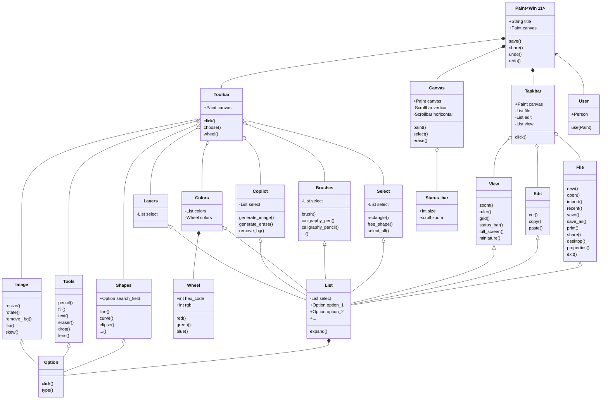

# reto_2
This repository refers to the activities proposed for class 5 of the Object Oriented Pogramming course.
___

- [Link to mermaid.live editor](https://mermaid.live/edit#pako:eNp9VttuGzcQ_RWBT00jC7pEFwt5ipsAAVK0gJoECAQsKO5olxCXXJBc27Jjf3t5X0qWrRdxRuQ5w5kzQz0iIkpAa0QYVuoviiuJmy131uBfTLkePP-kfDCZPA8et3xgPu83WlJeDTTVDILL7ySY32LlXQrfwh_vwrrGMhkdL0VcS_Drpy2PnP9hddhhmcheIl99o0oP9jSSextKqnP7lsKdtwmj5BBYPNqfV1eRJyMWgr1JnHDsuhZCxSvd1QDsJYHH6wluHNRbF9sQKZgL4hakpgSzFz_UQtIHwXX8qbUoKc_AgCQLJPYhnoR1EwhjVF9MHmNMHO7iYdECj2vatELqvmYEMsq8zGZdYBXNVuah5RIoQR20aPuNhs3cF9JRuKc6RB71IEzsX1zNY-SfTcVj5KRLTES0x4SMlYYLQJ-dWCLQDyOVCPQgRJNu2jGQ0agkLdNlNNadKgxa9Ow7xgpFJPRZayinZpu8xP_DiTPyb1zZYgRevr6UKeMa84ql_O0NT2Ey2sJp5QvMog6jmi3bJmBFvq8NrlLNJSj6kHCkMFfrLWiEKelgVyVmRlPZ1MHL5YzNoZ-2VRK9ERWhLIFRltYa7k-Fm1Jbyl4pDLi6QOk4espPslM1qNcTurMbkl4wo2botfWxyDR_6s2CHo1GFyIIlFlNbXX6Zv-n1VRwEwSWpC72FFgZbkR5SjfpZN9MYDKdJswrrJ4kmzCCCXl2b-J8wfPTTqrkOkO7Ce4eraVMvKHLCrgplYaC2pKnRoneNH8yKXklvSB2RD3zN3wE-Ur9zs76rVneU2um3NvJZzUe0JSbpa7RHVoYyy6f6XAP6FOWY9VwX9hHM3PJapcetH5gZMNgx7o4B0KR7Cx22Nm17T1fzXbUkHBfxeSidxq8Ri9xkraYl4HaYVpif6hnDiCPZw-ma8xjC2dP9HfTnf0zZtJvodzTburtXpr80flo-OwJe949Nh9_27qZULbcjfDMdpM4s8NkzDyxtzNXSOiJxys3cwVJZR6D7nvU-WJG_Lg6cflxmbnQENnXAK217GCIGpANtiZyOdkiXUMDW7Q2yxLLwxaZbJgzphC_jOjiMSm6qkbrPWbKWF1bmp4J_7_iFtxpsTlyko4AL0HeiI5rtL6erBwmWj-ie7SezkeL6WoyXsxWs_l0MV5-GKKjcc_Go8liuZgtF4vxarWcPg3Rg4tiPFrOV_Px7HoyWy2vZ9cf5kNk_0QJ-Xf4R2i_nv4HG99JxA)
